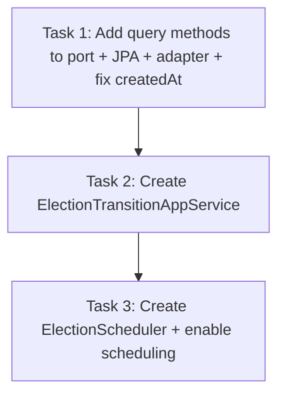

# Tasks: election-auto-scheduler

## Review Workload Forecast

Decision needed before apply: No
Chained PRs recommended: No
Chain strategy: pending
400-line budget risk: Low

- Estimated changed lines: ~250
- 400-line budget risk: Low
- Chained PRs recommended: No
- Delivery strategy: single-pr
- Decision needed before apply: No — single PR with low risk.

## Task Dependencies

## Tasks

### Task 1: Add query methods to port + JPA + adapter + fix createdAt
- **Description:** Update repository port and implementations to support finding elections by status and before a specific time. Fix the `createdAt` reset bug in `ElectionRepositoryAdapter` so it only sets on INSERT and is preserved on updates.
- **Affected Files:**
  - `src/main/java/.../electoral/domain/port/out/ElectionRepositoryPort.java`
  - `src/main/java/.../electoral/infrastructure/adapter/out/persistence/EleccionJpaRepository.java`
  - `src/main/java/.../electoral/infrastructure/adapter/out/persistence/ElectionRepositoryAdapter.java`
- **TDD test list:**
   - Verify `findByStatusAndFechaInicioLessThanEqual` returns correct elections with UTC boundaries (including `== now`).
   - Verify `findByStatusAndFechaFinLessThanEqual` returns correct elections with UTC boundaries (including `== now`).
  - Verify `createdAt` is preserved on update while `updatedAt` is updated.
- **Dependencies:** None
- **Status:** [x] COMPLETE

### Task 2: Create ElectionTransitionAppService
- **Description:** Create an application service wrapper that applies `@Transactional` boundary to the existing pure domain `ActivateElectionUseCase` and `FinalizeElectionUseCase`.
- **Affected Files:**
  - `src/main/java/.../electoral/application/service/ElectionTransitionAppService.java`
- **TDD test list:**
  - Verify `activate(UUID)` delegates to `ActivateElectionUseCase` inside a transaction.
  - Verify `finalize(UUID)` delegates to `FinalizeElectionUseCase` inside a transaction.
- **Dependencies:** Task 1
- **Status:** [x] COMPLETE

### Task 3: Create ElectionScheduler + enable scheduling
- **Description:** Implement a scheduled poller running every 60s, querying due PROGRAMADA or ACTIVA elections, and invoking the app service transitions with individual try/catch blocks for fault isolation. Add `@EnableScheduling` to the main application class.
- **Affected Files:**
  - `src/main/java/.../electoral/infrastructure/adapter/in/scheduler/ElectionScheduler.java`
  - `src/main/java/.../ElectoralVotappApplication.java`
- **TDD test list:**
  - Verify scheduler loop calls app service per election.
  - Verify error isolation: one throwing election doesn't stop the rest of the batch.
  - Verify errors are logged appropriately.
- **Dependencies:** Task 2
- **Status:** [x] COMPLETE
